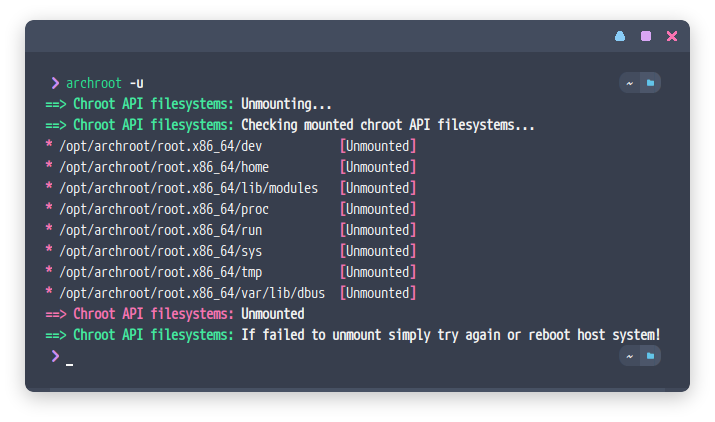
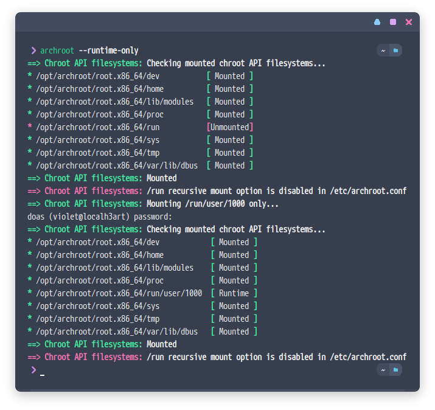
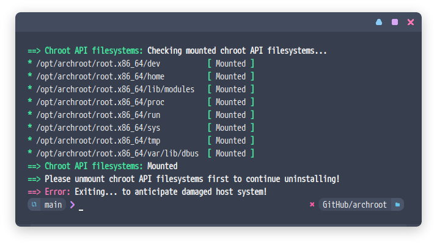

<p align="center"><a name="top" href="#octocat-why-chroot-"></a></p>
<p align="center">Install Arch Linux inside chroot environment using same user environment</p>
<p align="center"><b>This fork contains fancy and structured output</b></p>
<p align="center">Systemctl isn't working inside chroot environment, so it will automatically use <a href="https://github.com/lemniskett/servicectl">this</a> instead</p>
<p align="center"><i>Not all services can run normally</i></p>

##  

### :octocat: Why chroot? 


Since I'm using a complex Linux distribution like Gentoo, there are several reasons why I should also use Arch Linux in a chroot environment. First, I had a hard time (oh actually not being comfortable) with installing wine (multilib/32-bit) on Gentoo, and using wine in Archroot instead. The second reason is of course Gentoo's repositories are lacking even though has overlay and I miss AUR. [@owl4ce](https://github.com/owl4ce)

Thanks to [@lemniskett](https://github.com/lemniskett) (original author)

## :syringe: Installation 
#### Dependencies
`bash` `tar` `wget/curl` `xorg-xhost`

Easy, just clone and run `install.sh` as **root**. Next, you are asked to configure **local username** in `archroot.conf`.
```bash
$ git clone https://github.com/owl4ce/archroot.git && cd archroot/ && sudo ./install.sh
```
> - Arch Linux root directory will be installed to `/opt/archroot/root.x86_64/` after extracting tarball.
> - Configuration will be installed to `/etc/archroot.conf`.

### `archroot.conf`
#### Adding environment variables
> Optional according to your needs

Here is an example of `ENV_VAR` using qt5ct as qt themer and enable [gtk3-nocsd](https://github.com/PCMan/gtk3-nocsd):
```cfg
...

11 # Put your desired environment variable here, for example
12 # ENV_VAR="QT_QPA_PLATFORMTHEME=qt5ct"
13 ENV_VAR="QT_QPA_PLATFORMTHEME=qt5ct GTK_CSD=0 LD_PRELOAD=/home/violet/.themes/libgtk3-nocsd.so.0"

...
```

#### Mount options
> Customize yourself **(yes/no)**

```cfg
...

15 # Mount options
16 # Verbose mount/unmount process
17 VERBOSE_MSG="no"
18 # Mount /run ?
19 MOUNT_RUN="yes"
```

After installing, you will see a shell prompt when you enter Archroot environment.
```bash
$ archroot --enter
(Archroot) $
```

You may experience the terminal getting weird when entering chroot environment. Yes, maybe because terminfo doesn't match or doesn't exist between host and chroot environment.

The solution is to simply install `<terminal>-terminfo`, here I am using `rxvt-unicode`.
```bash
(Archroot) $ sudo pacman -S rxvt-unicode-terminfo
```

## :anchor: Usage
```bash
USAGE: archroot OPTIONS

OPTIONS:
  -c, --create URL      Creates a chroot environment.
  -m, --mount           Mount chroot API filesystems.
  -u, --unmount         Unmount chroot API filesystems.
  -r, --remount-run     Remount /run to chroot environment.
      --runtime-only    Mount $XDG_RUNTIME_DIR to chroot environment.
  -s, --status          Check mounted chroot API filesystems.
  -e, --enter           Enters chroot environment.
  -h, --help            Displays this help message.

Install Arch Linux inside chroot environment using same user environment
https://github.com/owl4ce/archroot
```
### Installing chroot environment
Download link see [here](https://www.archlinux.org/download/). Then do
```bash
$ sudo archroot -c archlinux-bootstrap-tarball-download-link.tar.gz
```
**Example link**: http://mirrors.evowise.com/archlinux/iso/2020.11.01/archlinux-bootstrap-2020.11.01-x86_64.tar.gz  
**Tips**: Skip tarball download process, just put the downloaded tarball file to `/opt/archroot/`. Then do
```bash
$ sudo archroot -c fill-anything
```

### Mounting chroot API filesystems
> Skip this if you have just finished installing the chroot environment for the first time or try reboot host before using. You will be automatically asked for root password when executing archroot options.
```bash
$ archroot -m
```
<details>
<summary><strong>Screenshot</strong></summary>
  
<p align="center"></p>

</details>

### Unmounting chroot API filesystems
```bash
$ archroot -u
```
<details>
<summary><strong>Screenshot</strong></summary>
  
<p align="center"></p>

</details>

### Entering chroot environment
```bash
$ archroot -e
```

### Executing chroot's commands directly
```bash
$ archroot commands
```

### Known issues
> See spesifics at [lemniskett/archbox#known-issues](https://github.com/lemniskett/archbox#known-issues).

#### Late package version
This can be seen when installing a package like `imagemagick`, I often experience it when doing reinstall test several times. Somehow sometimes this happens. The solution is quite easy, just install `reflector` and generate latest mirror list.

```bash
(Archroot) $ sudo pacman -S reflector
(Archroot) $ sudo reflector --verbose --latest 5 --sort rate --protocol http --protocol https --save /etc/pacman.d/mirrorlist
```

#### Remount `/run`
When you make Archroot automatically mount API filesystems when host boots, there is usually `$XDG_RUNTIME_DIR` is not visible in chroot environment, remounting will make it visible.

So because of this, I prefer [manual mount](#mounting-chroot-api-filesystems) after host system boots.  
So Archroot is only needed when it's needed.
```bash
$ archroot -r
```
<details>
<summary><strong>Screenshot</strong></summary>
  
<p align="center"></p>

</details>

#### Mount `$XDG_RUNTIME_DIR`
> NixOS-specific issues

Mounting `/run` somehow breaks NixOS, set `MOUNT_RUN` in `/etc/archbox.conf` to "no" to disable mounting `/run`, then unmount API filesystems and mount it again first. Then do
```bash
$ archroot --runtime-only
```
<details>
<summary><strong>Screenshot</strong></summary>
  
<p align="center"></p>

</details>

## :bulb: Tips
### Bypass root password question
**SUDO**  
```bash
$ sudo visudo
```
Then add this to the bottom line (`/etc/sudoers`):
```cfg
%wheel  ALL=(root) NOPASSWD: mount,umount,/opt/archroot/copyresolv,/opt/archroot/command
```

**DOAS**  
Add this to `/etc/doas.conf`:
```cfg
permit nopass keepenv :wheel as root cmd mount
permit nopass keepenv :wheel as root cmd umount
permit nopass keepenv :wheel as root cmd /opt/archroot/copyresolv
permit nopass keepenv :wheel as root cmd /opt/archroot/command
```

<details>
<summary><strong>Include pacman package manager from Archroot into neofetch host</strong></summary>

  ```bash
  $ sudo $EDITOR `which neofetch`
  ```
  Then edit this section
  ```cfg
  ...
  
  1305     case "$os" in
  1306         "Linux" | "BSD" | "iPhone OS" | "Solaris")
  1307             # Package Manager Programs.
  1308             has "pacman-key" && tot pacman -Qq --color never
  1309             has "dpkg"       && tot dpkg-query -f '.\n' -W
  1310             has "rpm"        && tot rpm -qa
  1311             has "xbps-query" && tot xbps-query -l
  1312             has "apk"        && tot apk info
  1313             has "opkg"	  && tot opkg list-installed
  1314          	 has "pacman-g2"  && tot pacman-g2 -Q
  1315             has "lvu"        && tot lvu installed
  1316             has "tce-status" && tot tce-status -i
  1317             has "pkg_info"   && tot pkg_info
  1318             has "tazpkg"     && tot tazpkg list && ((packages-=6))
  1319             has "sorcery"    && tot gaze installed
  1320             has "alps"	  && tot alps showinstalled
  1321             has "butch"	  && tot butch list
  
  ...
  ```
  into
  ```cfg
  ...
  
  1305     case "$os" in
  1306         "Linux" | "BSD" | "iPhone OS" | "Solaris")
  1307             # Package Manager Programs.
  1308             has "pacman-key" && tot pacman -Qq --color never
  1309             has "dpkg"       && tot dpkg-query -f '.\n' -W
  1310             has "rpm"        && tot rpm -qa
  1311             has "xbps-query" && tot xbps-query -l
  1312             has "apk"        && tot apk info
  1313             has "opkg"	  && tot opkg list-installed
  1314           	 has "pacman-g2"  && tot pacman-g2 -Q
  1315             has "lvu"        && tot lvu installed
  1316             has "tce-status" && tot tce-status -i
  1317             has "pkg_info"   && tot pkg_info
  1318             has "tazpkg"     && tot tazpkg list && ((packages-=6))
  1319             has "sorcery"    && tot gaze installed
  1320             has "alps"	  && tot alps showinstalled
  1321             has "butch"	  && tot butch list
  1322             pacman(){
  1323                archroot pacman -Q
  1324             }
  1325             has "pacman" && tot pacman
  
  ...
  ```

</details>

### Shared fonts, themes, and icons
Archroot will not read resources from host `/usr/share` directory. Because to avoid conflict, Archroot must have its own `/usr/share` directory. If you want to share from the host, you can use `~/.fonts` also`~/.themes` and `~/.icons`.

### Installing yay AUR Helper
Just run this in chroot environment <kbd>--enter</kbd>:
```bash
$ git clone https://aur.archlinux.org/yay-bin.git && cd ./yay-bin && makepkg -si && cd .. && rm -rf yay-bin
```

## :confetti_ball: Improving usage
### Using rofi as application launcher
First, install rofi in the Archroot.
```bash
(Archroot) $ sudo pacman -S rofi
```
Basic usage:
```bash
$ archroot rofi -show drun
```

Then you can add it as a DE/WM keybind (e.g: OpenboxWM):
> Need [bypass root password question](#bypass-root-password-question).
```cfg
bash -c 'archroot rofi -show drun'
```

**If you use my [dotfiles](https://github.com/owl4ce/dotfiles), I suggest following this.**

Edit [`~/.config/openbox/rc.xml`](https://github.com/owl4ce/dotfiles/blob/master/.config/openbox/rc.xml), then add this to keyboard tag:
```cfg
...

453 <!-- ARCHROOT -->
454     <keybind key="A-r">
455       <action name="Execute">
456         <command>bash -c 'archroot ~/.config/rofi/scripts/appsmenu.sh'</command>
457       </action>
458     </keybind>
459     <keybind key="W-S-Return">
460       <action name="Execute">
461        <command>bash -c 'urxvt -e archroot --enter'</command>
462      </action>
463    </keybind>

...
```
It will use rofi apps configuration as Archroot launcher, press <kbd>Alt + R</kbd> and launch Archroot terminal by pressing <kbd>Super + Shift + Enter</kbd>.

Host Environment|Chroot Environment
|--|--|
|

## :gun: Uninstall Archroot completely
The most important thing here is don't forget to unmount the chroot environment API filesystems, otherwise the host system will be deleted in the same shared directory (API filesystems).

If you forget it, relax. You will be notified by `install.sh` script when you run `install.sh -u`.
```bash
$ sudo install.sh -u
```
  
<p align="center"></p>
